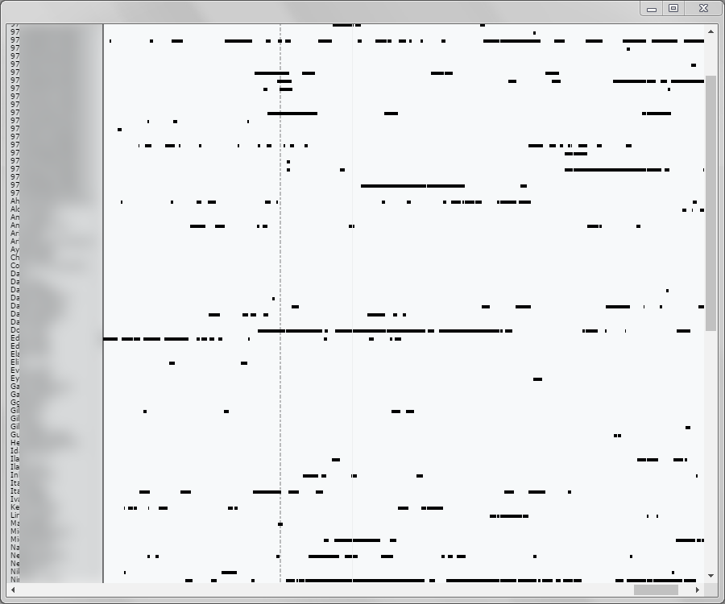

#  WhatsappTracker
WhatsappTracker

Vi siete mai chiesti che cosa potete imparare sulle persone perseguendoli in WhatsApp XD?
WhatsappTracker è un'app di Chrome che si aggancia all'app Web di WhatsApp su [web.whatsapp.com] (https://web.whatsapp.com/)
per controllare ripetutamente se i tuoi amici sono online.
Queste informazioni sono raccolte e archiviate localmente sul tuo computer, in modo che tu possa visualizzarlo successivamente e analizzare l'attività dei tuoi amici.
Puoi scoprire quanto tempo impiegano con WhatsApp, e se lo usano molto puoi anche sapere quando vanno a dormire o quando si svegliano!

## Come ho fatto?

Molto tempo fa ho avuto l'idea di scrivere manualmente i tempi "visti" di WhatsApp di qualcuno durante il giorno per scoprire quanto tempo sono stati con WhatsApp aperto.
"Se qualche codice Javascript su una pagina sta ottenendo le informazioni necessarie, allora sicuramente posso prenderle anch'io e tenere traccia di tutti i miei amici in una volta! ", pensai.

Il primo tentativo di ottenere i dati da MITM-in nel WebSocket che é la pagina utilizzata per comunicare con il suo server non ha avuto successo, poiché alcune delle comunicazioni pertinenti sono state crittografate.
Dopo aver perso un sacco di tempo ad esplorare questa direzione, ho finalmente scoperto che molte delle funzioni di WhatsApp erano presenti `window.Store`, aspettando solo che uno le chiami.
Sono riuscito a ottenere le informazioni sulla presenza iscrivendomi agli aggiornamenti di presenza per ciascuno dei contatti
e controllando se sono online ogni secondo.

Per rendere gli appostamenti dei tuoi amici un'esperienza piacevole, WhatsappTracker è costruito come app Chrome con le seguenti finestre:
- La finestra "record" ti chiede di accedere a una webview di [web.whatsapp.com] (https://web.whatsapp.com/)
quindi può iniettare script di contenuto nella pagina e raccogliere le informazioni sulla presenza.
- La finestra "online" mostra quali dei tuoi amici sono attualmente online. (Funziona solo se stai registrando)
- La finestra "Timeline" racchiude tutti i dati di attività che hai registrato in un grande grafico temporale.
(Utilizza la libreria [D3] (https://d3js.org/) per creare il grafico in SVG)
- La finestra "launcher" è la prima ad aprire e da lì è possibile aprire le altre finestre.

I grafici della timeline si sono rivelati molto interessanti e a volte abbastanza sorprendenti.
Alcune persone che ero sicuro trascorrevano la maggior parte della giornata usando WhatsApp erano in realtà utenti moderati,
mentre altri di cui non sospettavo nemmeno che mandassero dei messaggi spaventosamente lunghi, a volte a tarda notte.

## Implicazioni sulla sicurezza

Sebbene sia sicuramente inquietante, non è chiaro se si tratti di una vulnerabilità di sicurezza o meno. L'indicatore online è uno dei principali e le funzionalità di WhatsApp. 
Potrei perseguitare anche le persone per strada :)

WhatsApp può aggiungere un'opzione per disabilitare l'indicatore online per lo stato di più persone.

## Installazione

Apri `chrome://extensions /`, abilita la casella di controllo "Modalità sviluppatore" nella parte superiore della pagina,
premere "Carica estensione scompattata ..." e selezionare la cartella con questa app.
Ora puoi aprire WhatsappTracker proprio come un normale programma.
(Se sei su Windows, cercalo nel menu Start)

## Problemi noti

Ogni volta che il mio telefono non riesce a trovare alcuna rete Wi-Fi e inizia a utilizzare Internet mobile,
l'app Web di WhatsApp dichiara che non è possibile connettersi al telefono e quindi la registrazione si interromperà.
Se il telefono dopo tot minuti non sará sbloccato almeno a me, la registrazione si bloccherá fatemi sapere se anche a voi da questo problema.
Reset del codice QR ogni volta che si chiude chrome.

## Lavoro futuro

Google ha [annunciato] (https://blog.chromium.org/2016/08/from-chrome-apps-to-web.html) la deprecazione delle app di Chrome.
Presto, WhatsappTracker dovrà essere riscritto su un'altra piattaforma per continuare a funzionare.
Piú nuove features.
1) Real-time del grafico della TimeLine.
2) App nativa prima sará fatta in NW.js prossimamente su electron.
3) Imbellimento della grafica generale.
4) Possibilitá di imbellire a proprio piacimento la visualizzazione di Whatsapp per esempio colori, bolle etc.
5) Nella modalitá Rec invece di un log, la possibilitá di vedere chi é realmente e quando é entrato.
6) Possibilitá di cercare fra i contatti nella TimeLine per vedere il grafico intero della persona desiderata.

## Licenza

WhatsappTracker è autorizzato dal MIT.
Vedere il file LICENSE.txt allegato per ulteriori informazioni.
